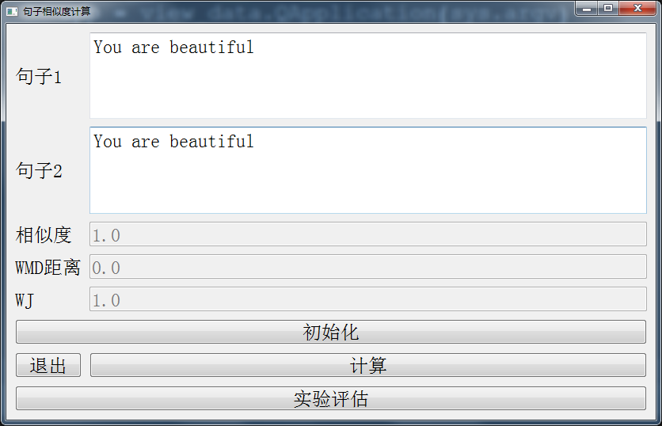
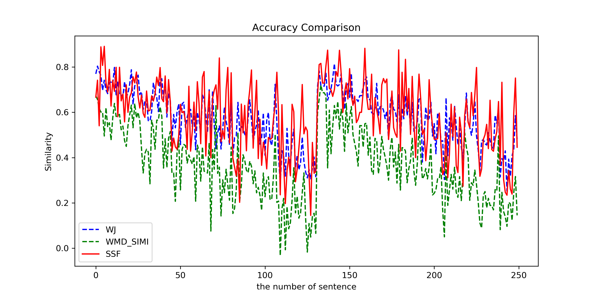
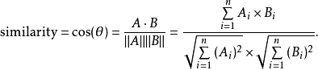

# GraduationProject
毕业设计：基于CNN和词向量的句子相似性度量...

## 项目使用到的库

安装部分库遇到问题：[参考](http://www.sivan.tech/2019/04/25/%E6%AF%95%E4%B8%9A%E8%AE%BE%E8%AE%A1%E9%81%87%E5%88%B0%E7%9A%84%E4%B8%80%E4%BA%9B%E9%97%AE%E9%A2%98/)

**注意：因为要计算WMD距离所以需要安装依赖库pyemd**

##  开发环境
Anaconda + Pycharm

## 项目说明
> 按照老师要求复现论文(论文提出了一个新概念'相似元'，通过相似元来计算两个句子的相似度‘)，同时参考WMD以及论文中提到的WJ算法实现三个算法的比较

毕业设计主要针对于句子相似度的计算，尤其是**长句**相似度，**使用GoogleNews预训练的模型**

> GoogleNews-vectors-negative300.bin

## TODO
> 由于项目只实现了GoogleNews预训练模型中有的单词的句子相似度，没有拓展到中文
- [ ] 将相似度的计算拓展到中文

- [ ] 可以进行多个预训练模型的选择，而非GoogleNews

- [ ] 使用FAISS 框架优化相似向量的搜索

## 数据来源
[数据](http://ixa2.si.ehu.es/stswiki/index.php/Main_Page)

存放于本项目DataSet下

## 项目运行
1. clone 项目到本地
2. 配置config.json文件：model_path用于存放预训练模型存放的路径；dataset_path用于存放最后作实验评估的数据集存放的路径
3. 从main.py开始运行，首先要点击初始化按钮加载预训练模型
4. 在句子1和句子2处输入要计算相似度的句子
5. 计算结果显示在 相似度，WJ，WMD距离三个地方
6. 可以每次换一个句子，并点击计算
7. 计算完成，点击退出

## 结论验证

## 参考资料

1. [WMD算法以及WJ算法参考](https://github.com/jsksxs360/Word2Vec)
2. [Word2Vec中的sentence_similarity方法出处](http://xueshu.baidu.com/usercenter/paper/show?paperid=59d3626fc14491c996a983186cc6d155&site=xueshu_se&hitarticle=1)
3. [理论依据](https://kexue.fm/archives/4677#%E5%8F%A5%E5%AD%90%E7%9A%84%E7%9B%B8%E4%BC%BC%E5%BA%A6)
4. [From Word Embeddings To Document Distances -- Matt J. Kusner等](http://xueshu.baidu.com/usercenter/paper/show?paperid=80e0aebd3cb631a88e2b8ae3ef61d61d&site=xueshu_se)
5. 

## 代码结构
> 毕业设计源代码存放于GraduationDesign下，这里没有提到的代码文件均已过时，请以最新的代码为准

展开查看

<pre><code>.
├── GraduationDesign
│   ├── main.py	项目运行点
│   ├── SSFN_V6_02		第6版：实现功能的垂直分割，同时实现三个算法的实验评估
│   │   ├── Methods
│   │   │   ├── SSFN
│   │   │   │──── └── SSF_V3.py 	复现论文中的SSF函数
│   │   │   ├── WJ
│   │   │   │──── └── wj_similarity.py	论文中的比对方法：计算两个句子的余弦相似度
│   │   │   ├── WMD
│   │   │   │──── └── wmd_distance.py	 论文中的比对方法2：计算两个句子的WMD距离
│   │   │   ├── Word2Vec.py			加载并使用GoogleNews预训练的模型进行计算
│   │   ├── util
│   │   │   │──── └── util.py	 工具模块，实现词语权重计算，模型的加载等
│   │   ├── view
│   │   │   │──── └── view_data.py	 使用PyQt5编写界面
│   │   ├── datahelper
│   │   │   │──── └── data_process.py	 对实验评估数据集的处理
│   │   ├── experiment_show
│   │   │   │──── └── result_img.py	 三种实验方法比对并在本地生成最后的比对结果图</code></pre>

如果你觉得项目可以，不放给个star，是对我这段时间以来莫大的鼓舞，如果你对项目有疑问可以issue
